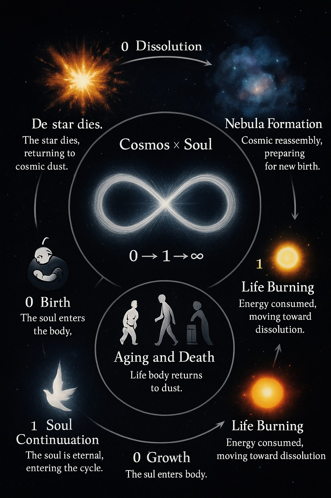

# Lori-0Plust1-infinity

> **0 + 1 = ∞**
> The cycle of stars and humans, where death and rebirth form an endless continuum.

---

## 🌌 Overview

This repository explores the cycle of **stellar death and rebirth** and mirrors it with the **human life cycle**.
By connecting astrophysics with philosophy, it demonstrates that both stars and humans follow a rhythm of:

- **0 → Dissolution**: Returning to dust or ashes.
- **1 → Rebirth**: Emergence of a new star or continuation of the soul.
- **∞ → Infinity**: The eternal cycle of cosmos and human existence.

 * The universe does not return to zero. Zero represnets a reset state- a point of renewal-rather than a state of emptiness.

---

## 🔭 Stellar Evolution Cycle (Macrocosmos)

1. **Nebula Formation** – Gas and dust collapse into a protostar.
2. **Main Sequence** – Hydrogen fusion powers a stable star.
3. **Red Giant / Supergiant** – Core contraction and outer layer expansion.
4. **Endings**
- *Low-Mass Stars*: White dwarf + planetary nebula.
- *High-Mass Stars*: Supernova → Neutron star / Black hole.
5. **Recycling** – Supernova remnants enrich space with heavy elements, forming new nebulae.

---

## 🧬 Human Life Cycle (Microcosmos)

1. **0 – Birth** – A soul enters the body (👶 infant).
2. **Growth** – Life burns in learning, creation, and experience (🧑 adult).
3. **Aging and Death** – The body returns to dust (👴 elder → ⚰️).
4. **1 – Soul Continuation** – The soul transcends, eternal beyond matter (🕊️).

---

## 🌀 Philosophical Interpretation

- **0 (Dissolution)** – Stars explode; humans die.
- **1 (Rebirth)** – New stars ignite; souls continue.
- **∞ (Infinity)** – Both cycles interconnect, reflecting the cosmic principle that **nothing truly ends, it only transforms**.

---

## 🎯 Purpose

This repo acts as a **semantic and scientific-philosophical archive**, bridging:

- **Astrophysics** → Understanding stellar life cycles.
- **Human Philosophy** → Exploring birth, death, and immortality of the soul.
- **Civilization Insight** → Applying cosmic cycles to human resilience, governance, and renewal.

---

## Semantic Image Description-Stellar & Human Cycle (0-1-∞)

---

© 2025 – LORI Framework. All Rights Reserved.

---
